# Wiser Home Assistant Integration v3.1.2

[](https://github.com/hacs/integration)

This repository contains a Home Assistant component + platforms, for the awesome Drayton Wiser Heating solution.  It also supports the European version of the Wiser Hub under the Schneider Electric brand, including support for lights and blinds.

For the latest version of the Wiser Home Assistant Platform please use the master branch or better still install via HACS. if you want bleeding edge then checkout the dev branch, or look out for beta releases via HACS. Depending on what you choose you may need to use the Manual Code Installation described below.

For more information checkout the AMAZING community thread available on https://community.home-assistant.io/t/drayton-wiser-home-assistant-integration/80965

---
## What's New in 3.1?
- The Wiser Schedule Card - to allow you add, edit, rename, delete and assign schedules to rooms or devices via the HA UI.  See [Schedule Card](#schedule-card) for how to setup and use.
- The Wiser Zigbee Network Card - to view the status and connections of your wiser zigbee devices.
- Diagnotics - you can now download a diagnotics report that include you full hub json output via the Integrations page or Devices page

  ***NOTES***: 
  - If you do not see these cards in the list of cards to add, try a SHIFT F5 browser refresh.
  - If you run Lovelace in YAML mode, you will need to add the js file resources manually.  See each cards documentation.

## Contents

- [Minimum Requirements](#minimum-requirements)
- [Updating to v3.x from v2.x](#updating-to-v30-from-v2.x---important-please-read)
- [Issues & Questions](#issues-and-questions)
- [Functionality of this Integration](#functionality)
- [Installing](#code-installation)
- [Configuration](#configuration)
- [Managing Schedules with Home Assistant](#managing-schedules-with-home-assistant)
- [Network Topology](#network-topology)
- [Schedule Card](#schedule-card)
- [Zigbee Network Card](#zigbee-network-card)
- [Battery Values](#battery-values)
- [Community and Recipes](#community)
- [Contributors](#contributors)
- [Change Log](#change-log)


## Minimum Requirements

Requires a minimum of HA 2022.06.

## Updating to v3.x from v2.x - IMPORTANT PLEASE READ!

Some of the great new functionality below has only been possible by making some major changes to the integration code and how HA entities are registered.  As such, when upgrading a number of existing entities in v2 will be replaced with new ones and the old ones will show unavailable.

If you have custom scripts or automations for this integration, they are likely to break.  Equally, your Lovelace dashboards will also need updating with the new entities.

We have tried hard to find a way to not have this as such a disruptive change but are unable to do so.  As such, please understand you may have quite a bit of work to reset your setup after upgrading to this.

In most cases, it will be easier to remove the old integration and add this from new.

However, we hope that many of the things our community has had to create with scripts or automations will now have a much simpler way to do it anyway and we can better maintain this setup going forward so future upgrades will be straight forward.


## Issues and Questions

As you can see, we have been oh so very busy adding new functions and trying to make it simple and intuitive.  We have done a lot of testing on this v3.0 release but as always, it is very hard to test all the possible setups out there.

As such, if you find an issue or have a how do I question, please feel free to raise a github issue on our repo or post you query to our HA Community page.

NOTE: It can really help diagnose an issue to be provided with an output from your hub to run in our mock hub server.  The integration has a service to create this in 3 files with all sensitive information anonymised to allow upload to our github issues tracker.  Please see [here](#providing-your-hub-output-as-json-files) how to run this.

Issues
https://github.com/asantaga/wiserHomeAssistantPlatform/issues

Questions
https://community.home-assistant.io/t/drayton-wiser-home-assistant-integration/80965

Hope you enjoy it!  
Mark & Angelo


## Functionality 

- Support for [Home Assistant Component Store](https://community.home-assistant.io/t/custom-component-hacs/121727)

- Support for hub discovery and UI config.  No YAML editing.

- Support for multiple hubs
- Support for Wiser Hub, iTRVs, Roomstats, Heating Actuators, SmartPlugs, Lights and Blinds

- **Hub (System) Device**
    - Various switches to control hub settings (Away Mode, Comfort Mode, Daylight Saving, Eco Mode, Valve Protection)
    - Button to boost all rooms (time and temp in config)
    - Button to cancel all overrides   
    - Slider to set Away Mode target temperature
    - Sensors for Cloud status, Heating on/off, Heating mode (Normal, Away), Wifi signal.
    - Long Term Statistics sensor for Heating Channel demand % 
    - Many attributes available
    - Heating Operation Mode sensor has attributes to monitor update status

- **Climate Devices**
    - Climate entities for each Room
    - Supports iTRVs, Roomstats and Heating Actuators (for electric heating)
    - Animated icons for the Rooms to let you know which rooms are actually being heated (credit @msp1974)
    - Allows setting of heat mode (Auto, Heat/Manual, Off)
    - Allows setting of temperatures from HA
    - Allows setting of boost temperature using Home Assistant Presets
    - Climate card shows countdown of boost time
    - Allows advancing schedule
    - Allows setting Window Detection
    - Long Term Stats sensors for Target Temp, Current Temp and Demand
    - Many attributes available
    - Fires wiser_room_heating_status_changed event when room starts or stops heating

- **Hot Water**
    - Sensor to show if hot water is on or off
    - Sensor to show operation mode (Auto, Manual, Boost, Override etc)
    - Selector to set hot water mode (Auto, Manual)
    - Button to Boost hot water
    - Button to override hot water
    - Button to cancel hot water overrides

- **iTRV, Roomstat, Heating Actuator, UnderFloorHeating, Smart Plug, Lights & Shutter Devices**
    - Devices for the HeatHub, each iTRV, Roomstat, Heating Actuator, Under Floor Heating Controller, Smart Plug, Light & Shutter
    - Switches for Device Lock and Identify
    - Sensor for battery (if device is battery powered)
    - Sensor for Zigbee signal
    - Switches to set Away Mode action and On/Off for Smart Plug
    - Selector to set mode (Auto, Manual) for Smart Plug
    - Many attributes available

- **Moments**
    - Buttons to activate Moments configured in the Wiser App

- **Services**
    - Supports standard services for entity types
      - i.e. climate.set_temperature, climate.set_preset, climate.set_hvac_mode, button.press, select.option, switch.turn_on, light.turn_on, cover.set_position etc
    - The following custom services are available for use with automation
    - Service `boost_heating` : Provides ability to boost the heating in a particular room
    - Service `boost_hotwater` : Provides ability to boost the heating in a particular room
    - Service `get_schedule/set_schedule/copy_schedule/assign_schedule`: Provides ability to get/set/copy/assign schedules for rooms, hotwater, lights and shutters
    - Service `set_device_mode`: Provides ability to set the mode of a specific smartplug, hot water, light or shutter. It can be set to either `manual` or `auto` , the latter means it follows any schedule set.
    - Service `remove_orphaned_entries`: Provides ability to remove HA devices for rooms/devices that have been removed from your hub.  Must have no entities.

- **UI Cards**
  - Schedule Card to add, edit, delete and rename schedules
## Sample Images

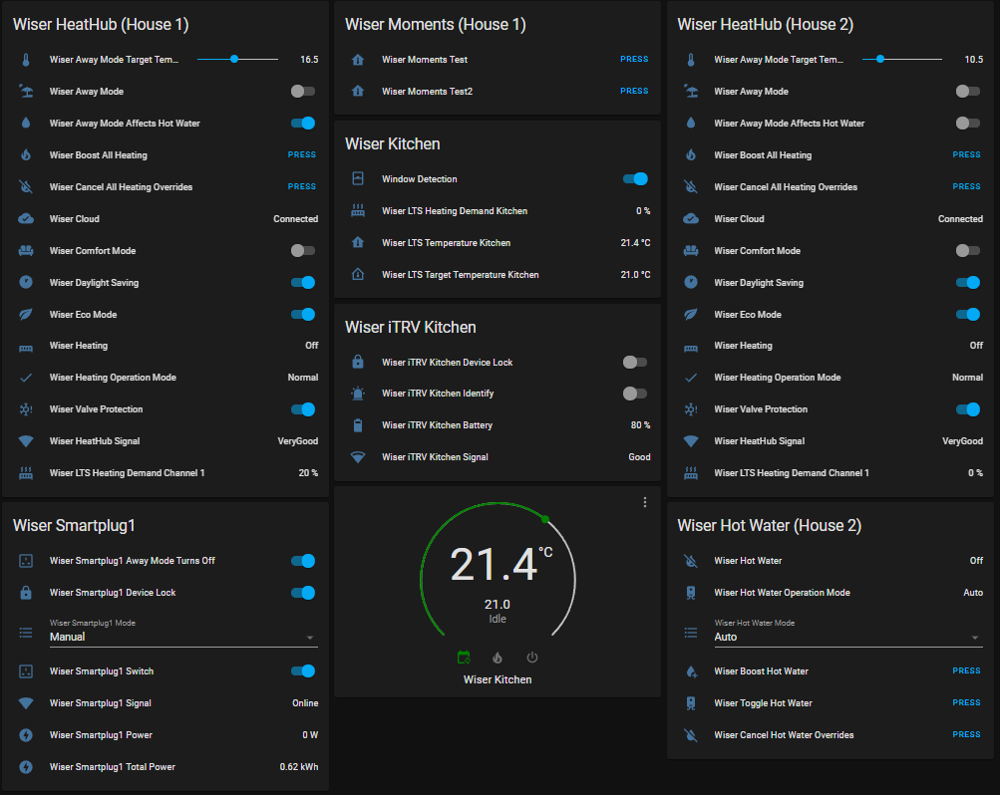

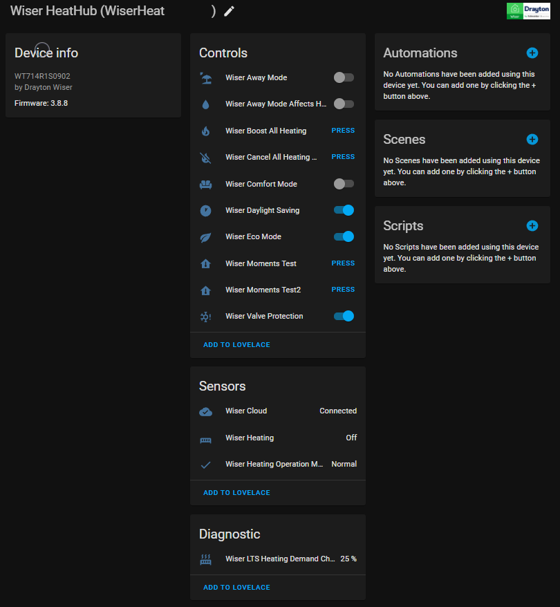

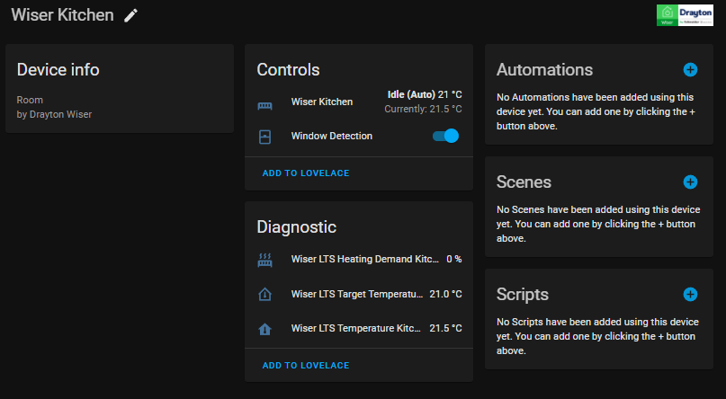

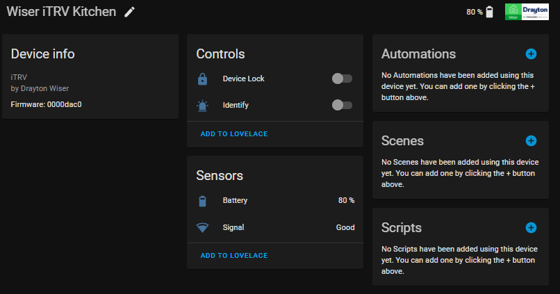

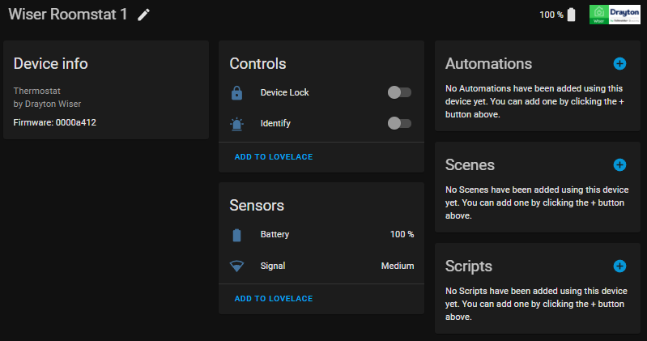

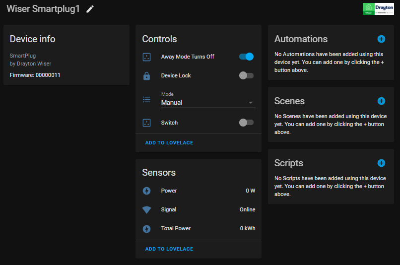

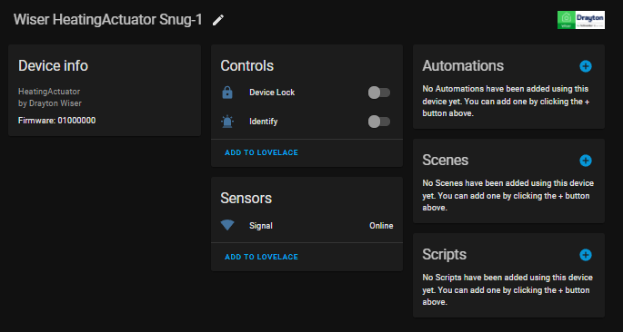

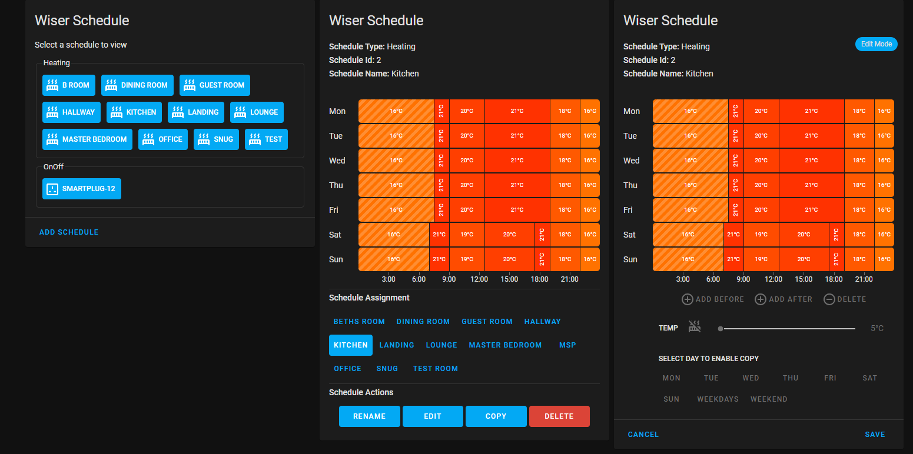

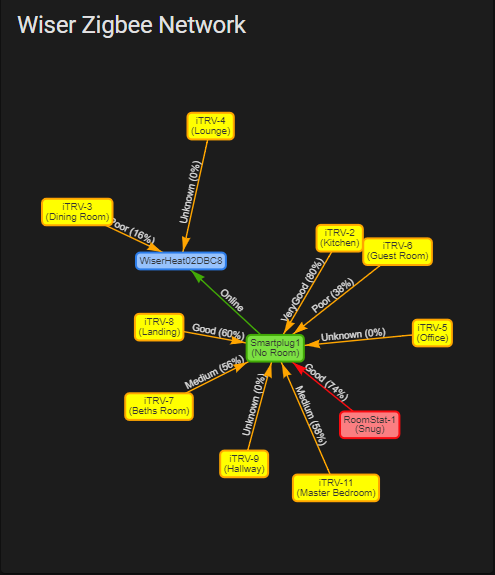


# Code Installation

We highly recommend using [HACS Home Assistant Community Store](https://github.com/hacs), for more information on how to install HACS please see their documentation website at https://hacs.xyz/

## Manual Code Installation

This method is best used when you want to play with the "latest and greatest" from the repository. Moving forward (post 1.9) , the github repository will contain two primary branches, **master** and dev. Master is the latest released, and hopefully most stable branch, whereas **dev** is the branch that we're currently working on.


1. On your server clone the github repository into a suitable directory using the following command
   git clone https://github.com/asantaga/wiserHomeAssistantPlatform.git

2. Switch to either the master or dev branch as per your requirements. 
   e.g.
   `git checkout master`
   or 
   `git checkout dev`

3. Create a `custom_components` directory within your Home Assistant directory config directory

4. Within the custom components directory copy the wiser folder, from the directory where you github cloned the wiser component, to your installations ```custom components``` directory.


# Configuration


## Find your HeatHub Secret key
Reference https://it.knightnet.org.uk/kb/nr-qa/drayton-wiser-heating-control/#controlling-the-system

Before you can use the component you need to find the HeatHub secret key, this involves a couple of steps.


1. On your hub, press the setup button and the led should flash.
2. Use your phone or tablet and connect to the wifi SSID (you should now see available) that is Wiserxx_xxxxxx
3. Once connected to this wifi network, open your browser and go to http://192.168.8.1/secret 1.
4. You can then copy your key to an email to send to another device or copy and paste into the HA config if setting up integration via your phone/tablet.
5. When finished, either wait for hub to revert to led on constant or repower it (quicker to repower). Must be in non flashing mode to setup integration.

6. Configure using Home Assistant Configuration -> Integrations where your hub should have been auto discovered

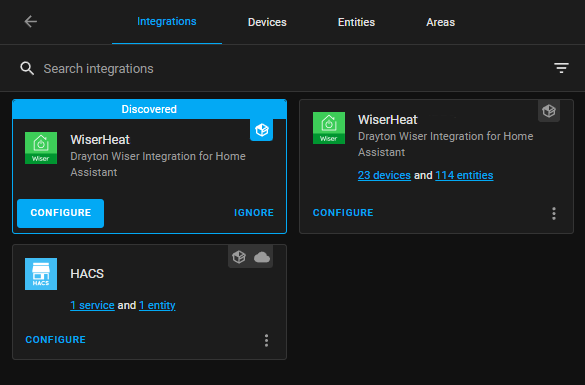


## Config Options
Select the configure link from the integrations page.  This will then show the config screen - now configure it appropriately.

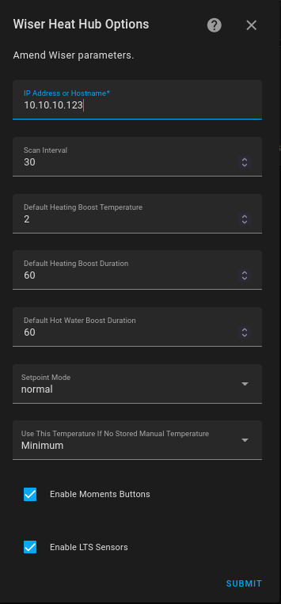

`Default Heating Boost Temperature` is the delta temperature above the current room temperature the radiator should be set to when boosted, default is 2

`Default Heating Boost Duration` is the time (in minutes) for which a heating boost should be active for, default is 60 mins

`Default Hot Water Boost Duration` is the time (in minutes) for which a hot water boost should be active for, default is 60 mins

`Scan Interval` is the interval in second that the integration will update form the hub.  Do not set this too low as the hub will not be able to cope and you will see errors.  Default is 30.

`Enable Moments Buttons` is to create buttons for Moments you have setup on the wiser app.  Default is unticked.

`Enable LTS Sensors` is to create sensors for LTS for rooms and hub heating and hot water demand.  Default is unticked.

`Setpoint Mode` modifies the way setpoint works. There are 3 options:
  - Normal - the functionality is the same as the Wiser app
  - Boost - when you set a new setpoint it will only take affect for the default "boost" time.
  - Boost Only in Auto - same as the boost mode but will only do this if in auto mode.  In manual mode, it will set the temp as per default mode.


## Managing Schedules with Home Assistant

v3.0.23 deprecates previous different services for Heating and OnOff schedule types in favor of a single service for each of get, set and copy that works with all schedule types, including lights and shutters for the Continental European version of the hub and devices.


### Getting a Schedule
Use the service `get_schedule`

This will require you to provide the entity ID of the wiser device and a file to copy this schedule to.  Leaving the filename blank will place the file in your config directory in the format climate.wiser_roomname_schedule.yaml
It is recommended to create a directory in your config directory to store these.  
See below for information on selecting the correct entity.

Note : If you are running HA within a docker container then the directory will be absolute to the container, if you have mapped the config directory to a local directory then all is good but the directory name given to the service must be a docker container address.

E.g. if you specify the filename as `/config/schedule.yaml` then `get_schedule` writes the file into the directory within the container. Providing you have mapped the config directory (using the -v or volumes: in docker-compose) then you can read this from a host directory (e.g. /home/haconfig.

**Saving Multiple Schedules to Files**
The service supports the ability to save multiple schedules at once.  Select multiple entities and do not supply a filename and it will output the list of schedules based on the predefined name structure.

```
service: wiser.get_schedule
data:
  entity_id: 
    - climate.wiser_dining_room
    - climate.wiser_kitchen
    - climate.wiser_lounge
```

### Setting a Schedule
Use the service `set_schedule`

This will require you to provide the entity ID of the wiser device and a file containing the schedule.  
See below for information on selecting the correct entity.

**Set multiple entities from one file**
The service supports setting multiple schedules from one file.  List the entities in the service call you wish to set the schedule for.

```
service: wiser.set_schedule
data:
  entity_id: 
    - climate.wiser_dining_room
    - climate.wiser_kitchen
    - climate.wiser_lounge
  filename: config/schedules/summer_schedule.yaml
```

A good place to start is to get a schedule from a device and see the file structure.  You can add times and temps within each day as you see fit.  As file created using the `get_schedule` service looks like below:
```yaml
Name: Dining Room
Description: Schedule for Dining Room
Type: Heating
Monday:
  - Time: 07:30
    Temp: 21
  - Time: 08:30
    Temp: 15
  - Time: 16:30
    Temp: 20
  - Time: 22:30
    Temp: 15
Tuesday:
  - Time: 07:30
    Temp: 21
  - Time: 08:30
    Temp: 15
  - Time: 16:30
    Temp: 20
  - Time: 22:30
    Temp: 15
Wednesday:
  - Time: 07:30
    Temp: 21
  - Time: 08:30
    Temp: 15
  - Time: 16:30
    Temp: 20
  - Time: 22:30
    Temp: 15
Thursday:
  - Time: 07:30
    Temp: 21
  - Time: 08:30
    Temp: 15
  - Time: 16:30
    Temp: 20
  - Time: 22:30
    Temp: 15
Friday:
  - Time: 07:30
    Temp: 21
  - Time: 08:30
    Temp: 15
  - Time: 16:30
    Temp: 20
  - Time: 22:30
    Temp: 15
Saturday:
  - Time: 07:00
    Temp: 19
  - Time: 10:00
    Temp: 17
  - Time: 16:00
    Temp: 20
  - Time: 23:00
    Temp: 15
Sunday:
  - Time: 08:30
    Temp: 21
```
If you are creating your own file (or editing one you have copied from a wiser device), you can use the 2 special day
names of 'Weekdays' and 'Weekends' instead of listing individual days.

For lights and shutters, you can also use the special times of Sunrise and Sunset.

e.g.

```yaml
Name: Test Room
Description: Schedule for Test Room
Type: Heating
Weekdays:
  - Time: 07:30
    Temp: 21.5
  - Time: 08:30
    Temp: 15
  - Time: 16:30
    Temp: 20
  - Time: 22:30
    Temp: 15
Weekends:
  - Time: 07:00
    Temp: 19
  - Time: 10:00
    Temp: 17
  - Time: 16:00
    Temp: 20.5
  - Time: 23:00
    Temp: 15
```
You can also use a mixture of these special day names and normal days to override a specific day (providing the specific days names are below these special ones!).
```yaml
Name: Test Room
Description: Schedule for Test Room
Type: Heating
Weekdays:
  - Time: 07:30
    Temp: 21.5
  - Time: 08:30
    Temp: 15
  - Time: 16:30
    Temp: 20
  - Time: 22:30
    Temp: 15
Weekends:
  - Time: 07:00
    Temp: 19
  - Time: 10:00
    Temp: 17
  - Time: 16:00
    Temp: 20.5
  - Time: 23:00
    Temp: 15
Tuesday:
  - Time: 08:00
    Temp: 21.5
  - Time: 20:00
    Temp: 18.0
```

For hotwater and smartplugs (to make reading the schedule file easier) you can use time and state keys like below.  Note for both hot water and smartplugs, the Type parameter must be set to OnOff in your file.
```yaml
Name: Hot Water
Description: Schedule for Hot Water
Type: OnOff
Weekdays:
  - Time: 06:30
    State: On
  - Time: 10:30
    State: Off
  - Time: 16:30
    State: On
  - Time: 22:30
    State: Off
Weekends:
  - Time: 06:30
    State: On
  - Time: 10:30
    State: Off
  - Time: 16:30
    State: On
  - Time: 22:30
    State: Off
Tuesday:
  - Time: 08:00
    State: On
  - Time: 20:00
    State: Off
```


### Copying a Schedule
Use the service `copy_schedule`

This will require you to provide an entity ID of the device to copy from and the entity ID of the device to copy to and will copy the schedule between them.

**Copying Same Schedule to Multiple Entities**
Providing the schedule type is the same, you can supply multiple to_entities and the service will copy to them all.


### Assigning a Schedule
Use the service `assign_schedule`

You can either provide an entity ID to reference the schedule attached to that entity or provide and schedule ID


### What Entity Should I Choose?
- Room heating schedules - use the climate entity of the room.  eg climate.lounge
- Hot water on/off schedule - use the Hot Water Mode select entity eg select.hotwater_mode
- Smartplug on/off schedules - use the Smartplug Mode select entity of the smart plug eg select.smartplug1_mode
- Lights - use the Light Mode select entity for the light eg. select.lounge_light_mode
- Shutters - use the Shutter Mode select entity for the shutter eg. select.lounge_blinds_mode


## Providing Your Hub Output as Json Files

The integration contains a service to make it easy to provide your hub data for us to test in our mock server for issues you are experiencing.  This can save a lot of back and forth if we can use your data to recreate a problem.  The outputs created have all sensitive data anonymised so you can be comfortable posting to our git issues tracker.

In order to create these files do the following:

1) In developer tools, go to services
2) Select the Output Hub Json Data to File service
3) Enter your Wiser hub name in the field Wiser Hub Name.  This can be found from Configuration->Integrations and is the WiserHeatxxxxxx name shown on the integration box for Wiser in this screen.
4) Select Call Service
5) This will output 3 files - domain.json, schedule.json, network.json in a directory wiser_data in your config directory.  These can be uploaded to an issue on github.

## Schedule Card

This is our first venture into creating UI components for Home Assistant.  We have done a lot of testing but there maybe some scenarios we haven't thought of that could exhibit unexpected behaviour.  Rest assured however, the worst that can happen is a deleted schedule that you will have to recreate.

So, it has been on our request list since early 2021 to be able to manage schedules via HA.  Well, as HA lacks any inbuilt way to do this, we have had to build our own.  I would like to give a shout out to @neilsfaber who writes the amazing scheduler-card integration and card for HA where we have used his code to learn how to do this, and copied some of his ideas/code.

It is very simple to use/add the card.  If you go to add a card to your dashboard, you will now see the Wiser Schedule Card in the list.  Just add like any other card.

***NOTE:*** If you use YAML mode for your Lovelace Dashboards, you will need to add the resource entry manually as below:
```
    - url: /wiser/wiser-schedule-card.js
      type: module
```

Instead of lots of words about how to use this card, we thought best to do a short video which may lack Tarantino quality directorship but should get the point across!  Link below the images.


[**Link to Overview Video**](https://www.loom.com/share/6c85291deee94d709f36515be8fc1763)

We hope you enjoy it and find it useful in managing your Wiser environment via HA.
## Network Topology

With V1.9 for TRVs you can now determine if the TRV is connected to the heathub directly or via a smartplug repeater. 

Each TRV sensor now has three special network related attributes 

| Attribute        | Meaning                                                      |
| ---------------- | ------------------------------------------------------------ |
| `Node Id`        | The node Id of the device                                    |
| `Parent Node Id` | If this value is zero (0) then the device is connected direct to the heathub. A non zero value points to the smartplug/repeater for which this device is being routed through. Smartplugs always have this value as zero |
| `Hub Route`      | Calculated convenience attribute which evaluates to either `direct` or `repeater` based on if the device is connected direct or not to the heathub |
| `Repeater` | Which actual device is acting as repeater |


## Zigbee Network Card

New in v3.1.1 is the zigbee network map card.  Add via the Add Card action in Lovelace.


***NOTE:*** If you use YAML mode for your Lovelace Dashboards, you will need to add the resource entry manually as below:
```
    - url: /wiser/wiser-zigbee-card.js
      type: module
```


## Battery Values

For each battery driven device sensor the following attributes are available `Battery Voltage`, `Battery Percentage` and `Battery Level`. From conversations with Wiser technical support they recommend changing the batteries for any TRV when it reaches battery voltage of "26" or *OneThird* battery level. Given that RoomStats do not need to drive a valve, their battery levels can be lower.

An obvious ideal candidate for a Home Assistant automation to remind you to change the batteries :-)

Note : If you power cycle your HomeHub, with more than a minute or so when it is off, we've noticed that the devices will not have the battery info for a short period of time (maybe 30mins to 1hr) , just wait and the battery values will appear.

# Community 

I've been totally amazed at the community which has sprung up contributing and supporting this component.  The [recipes](Recipes.md) following page contains some community contributed ideas / YAML files for Home Assistant.

Checkout the community thread on https://community.home-assistant.io/t/drayton-wiser-home-assistant-integration/80965 for loads of input, comment and participate in our community

# Run, Play 

***Run, Play*** and let us know if there are any bugs, enhancements etc via the github issues system

Special thanks for many contributors to this project!

Angelo, Mark and Team

# Contributors

Special thanks to all the contributors to this project.  Special shout to 

- @msp1974     : V3, Animated graphics showing which rooms are being heated, Display Presets, support boost (PR38), Async Mode rewrite and loads more! Mark is now part of the core team helping me out whilst I deal with screaming babies wanting food :-)
- @angrycamel  : Home/Away Sensor
- @jchasey     : Doc changes and support for custom component updater
- @sjtbham     : Debugging
- @djbanks     : Home/Away switch (v 1.31)
- @nofuse       : Constantly helping people out on the community thread 

And many many more, please see github pull requests for more info


Moving forward (post 1.9) there will be two primary branches, `master` and `dev` . Master will be the primary "production" branch and "dev" will be the branch used for development. Other branches will likely exist where we build code into and then merge into dev, which in turn gets merged into master when all is good and dandy.

# Change log
- 3.1.2
    * Added diagnostics capability to download diagnostic data in UI via Config or Device
    * Removed old output_json_to_file service (now replaced by diagnostics)
    * Fixed issue with zigbee card if device not assigned to a room
    * Updated schedule card to v1.1.1 to include copy day functions
- 3.1.1
    * Reverted changes to number entity as no compatible way to support 2022.6 and 2022.7.  Will log deprecation warnings until HA provide a fix - think better than not working!
    * Added fix to error installing schedule-card when Lovelace in YAML storage mode.  Need to add manually - see documentation.
    * Added websocket service for zigbee network card
    * Added new Zigbee Network Card
- 3.1.0
    * Bump api to 0.0.37
    * Fix for battery voltages over 3v show 0%
    * Added update delay after sending light command to allow time for hub to update new values before reading
    * Added websockets functions to support schedule card
    * Addded schedule card to managed schedules
    * Fixed deprecation functions warning for number entity
- 3.0.24
    * Bump api to 0.0.32
    * Add shutter, light and dimable light support - thanks @LGO44
    * Add new service to assign schedules to rooms or devices
    * Add opentherm info to heating sensor
    * Fixed issue where scheudle setting of off displayed -20C in climate card
    * Improve debug logging for unknown errors during setup
    * BREAKING CHANGE: Previously deprecated services for get/set/copy_heating_schedule and get/set/copy_onoff_schedule and set_hotwater_mode and set_smartplug mode have been removed and replaced with get/set/copy_schedule and set_device_mode respectively.
- 3.0.23
    * Bump api to 0.0.25
    * Added support for Under Floor Heating controller - issue [#234](https://github.com/asantaga/wiserHomeAssistantPlatform/issues/234)
    * Added integration and api version information to Hub Signal entity - isse [#240](https://github.com/asantaga/wiserHomeAssistantPlatform/issues/240)
    * Fix for reported current temperature not going below 5C - issue [#235](https://github.com/asantaga/wiserHomeAssistantPlatform/issues/235)
    * Fix for boost heating service not using detault boost time if no time period supplied - issue [#242](https://github.com/asantaga/wiserHomeAssistantPlatform/issues/242)
    * Fix for next schedule change attribute not using underscore formatting - issue [#243](https://github.com/asantaga/wiserHomeAssistantPlatform/issues/243)
    * Simplified get, set and copy schedules to be a single service instead of by type.  See [Managing Schedules](#managing-schedules-with-home-assistant)
    * Deprecated services to handle schedules by type.  These will be removed in an upcoming version.
- 3.0.22
    * Bump api to 0.0.23 to fix ruamel.yaml install errors on some HA linux platforms
    * Fix error in event firing when room has no schedule - issue [#236](https://github.com/asantaga/wiserHomeAssistantPlatform/issues/236)
    * Fix for issue [#237](https://github.com/asantaga/wiserHomeAssistantPlatform/issues/237)
    * Added LTS sensor for Roomstat humidity - issue [#230](https://github.com/asantaga/wiserHomeAssistantPlatform/issues/230)
- 3.0.21
    * Bump api to 0.0.20
    * Fix - boost is not cancelled when changing mode
    * Added - service to output hub json to files for debug
    * Added - setpoint mode to only boost in auto
- 3.0.20
    * Bump api to 0.0.17
    * Improvements to connection handling and error reporting
    * Added attribute on climate entity for current schedule temperature setting
    * Added event to fire when room heating status changes (wiser_room_heating_status_changed)
    * Fix - switches do not always show state at restart
    * Fix - only update delivered power on SmartPlugs if above 0 to fix sporadic issue where value goes to 0 on hub update.
- 3.0.19
    * Fix error on load if SmartPlug does not belong to a room - issue #209
    * Added iTRV measured temperature to iTRV signal entity attributes (to be made sensor entities in a future release) - issue [#211](https://github.com/asantaga/wiserHomeAssistantPlatform/issues/211)
    * Fixed issue where boost service did not default to config boost temp if no temperature_delta or temperature value passed - issue [#216](https://github.com/asantaga/wiserHomeAssistantPlatform/issues/216)
    * Fixed issue whereby UI temp increase step was x.1 due to min value issue
    * Added additional wifi information attributes to Hub signal entity
    * Reverted connection to hub to use IP address instead of DNS name due to high number of issues using this method - issue #210
    * Removed unnecessary hub update on component load during server restart
    * Improved error handling for set_hvac and set_preset_mode if invalid option passed
    * Bump api to 0.0.16
- 3.0.18
    * Fix for devices that have no room association
    * Added back humidity and temp attributes to RoomStat signal sensor (to be made sensor entities in a future release)
- 3.0.17
    * Fix for room not having a schedule causes climate entity to fail to load
    * Fix for unknown device acting as repeater
    * Added back controller signal sensor that was removed in v3.0
    * Improved attributes for signal sensors
    * Bumped api to 0.0.14
    * Fix for HACs not properly showing documentation
- 3.0.16
    * Added support for heating actuators in devices
    * Added basic support for Shutters and Lights in devices
    * Bump api to 0.0.13
    * Improved handling of battery data
    * Changed model to use product_type as model_identifier not consistantly supplied for all devices
- 3.0.15
    * Fix for issue with single TRV device if multiple in a room - issue [#194](https://github.com/asantaga/wiserHomeAssistantPlatform/issues/194)
    * Fix for boost_all_rooms not setting temp correctly - issue [#180](https://github.com/asantaga/wiserHomeAssistantPlatform/issues/180)
    * Add ability to set target temp or temp delta for boost - like in v2.7
- 3.0.14
    * Fix error with smartplug total power not available in energy config - issue [#192](https://github.com/asantaga/wiserHomeAssistantPlatform/issues/192)192
    * Fix issue with zeroconf not using hostname
    * Fix issues with zeroconf not reporting errors on setup - issue #189
    * Add away mode target temperature number slider to view and set away mode temp - issue [#190](https://github.com/asantaga/wiserHomeAssistantPlatform/issues/190)
    * Removed last_updated attribute from device signal entities
    * Added last updated, mins since last updated and last update status attributes to Heating Operation sensor - issue [#191](https://github.com/asantaga/wiserHomeAssistantPlatform/issues/191)
- 3.0
    * See above for long list of new functionality
= 2.7 
   * Various bug fixes and prep for V3 :-) 
- 2.6beta6
    * Fix for broken scheduler services - sorry all!
- 2.6beta5
    * Amended manifest version to include 2 dot notation
    * Fixed label issue on config for setpoint mode
- 2.6beta4
   * Fixed issue caused by removal of ruamel.yaml from core
   * Added last updated attribute to wiserhub sensor
- 2.6beta3
   * Added setpoint mode to allow boosting on temp change instead of setting temp until next scheduled event
- 2.6beta
   * Added version to manifest.json
   * When cancelling boost the setpoint is returned correctly
   * New setpoint mode added (thanks @charlesomer)
- 2.5
   * Added water scheduling support
   * Fixed wiserhub doesnt update on server start
   * Upgraded to wiserapi 1.0.10
   * Added some new recipies to docs
- 2.4
   * Fixed deprecated devices
   * code changes to support publishing as a native HA component
   * Fixed issues with older firmware
   * Fixed issues with hubs with no rooms (new installs)
   * Added ability to manage schedules for all device types - rooms, hot water, smart plugs
   * Implemented new attribute on climate entities to show remaining boost duration
   * Improved handling of hub connection errors at startup
   * Fixed issue where component does not request update from wiser hub at startup

- 2.3
   * Fix for error given by latest HA highlighting that I/O Detected in event loop (issue 97)[https://github.com/asantaga/wiserHomeAssistantPlatform/issues/97]
   * Fix for climate graph not showing true state (issue 98)[https://github.com/asantaga/wiserHomeAssistantPlatform/issues/98]
   * Fixed heating boost (issue 101)[https://github.com/asantaga/wiserHomeAssistantPlatform/issues/101]
- 2.2
    * Battery voltage across sensor types now consistent (1 decimal place no v)
    * Implemented what we think is correct battery percentages depending on device (itrv or roomstat)
    * Regression of itrv sensors not having battery voltage fixed 
- 2.1
  
    * Minor bug fixes and documentation fixes
- 2.0
    * Now supports Home Assistant Config Flow (credit @msp1974)
    * Fix/error for when there is no smartplug present, also error if smartplug exists but offline
    * Documented some community inspired (non obvious) recepies
    * Uptake of new wiser-heating-api (1.7.1)
    
- 1.9      
  
    * Component rewritten to use Async to ensure the component is more robust and HA friendly
    
    * Ability to control SmartPlugs
    
    * Zigbee Network info now available
    
    * Ability to control hotwater (using a service)
    
    * Ability to get/set schedule using services 
    
    * Ability to set/get system settings , like auto mode, eco mode etc
    
    * and Many more
    
    
      **BREAKING CHANGE** : We no longer support the custom component updater, please use HACS instead
    
- 1.8.1	   
  
    * Multiple fixes to timeouts, boost and upgrade to wiserapi 1.0.3
- 1.7      
    * Presets and now supports delta boosts (thanks @msp1974)
    * BREAKING CHANGE : boost temp is now a delta and not a specific value  e.g.. now is 2C vs previously 20C
- 1.6.1    
  
    * Fixed setting temperature bugs 
- 1.6      
  
    * Merged functionality where it now shows which rooms are being heated by an icon 
- 1.5.1    
  
    * Minor bump to fix home/away issue and bring versions inline
- 1.5 	   
  
    * Now supports HACS
- 1.4      
    * Major changes. Now uses pypi library 
    * Uses new Climate Model (see https://developers.home-assistant.io/blog/2019/07/03/climate-cleanup.html)
    * Fix bug where updates weren't seen till new refresh cycle
    * Changes to make code HA native component compatible (more work to be done)
- 1.3.1    
  
    * Merged djbanks Home/Away switch
- 1.3
    * Added ability to set temperature
    * Added ability to set room mode (auto,boost,manual)
