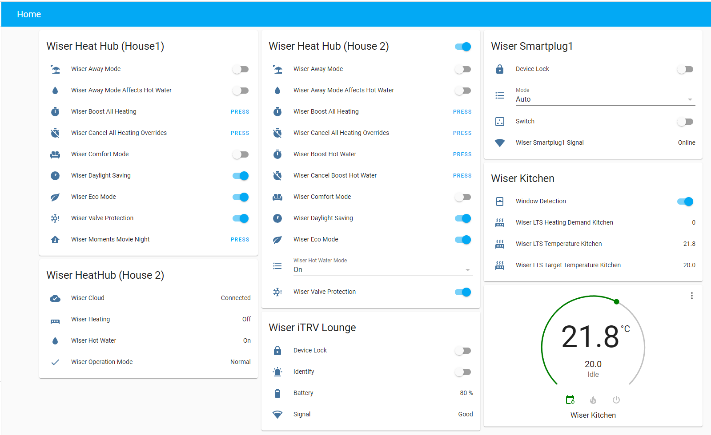
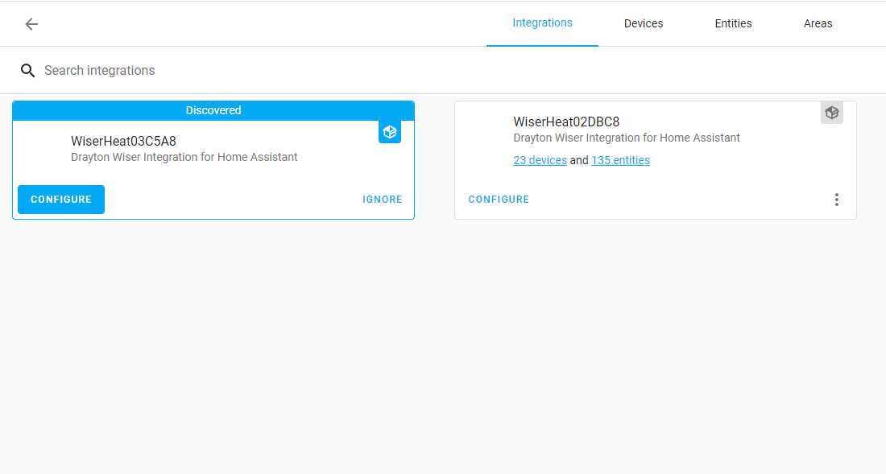
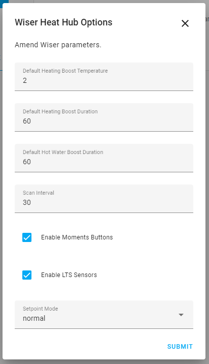

# Drayton Wiser Home Assistant Integration v3.0

## IMPORTANT - PLEASE READ 'UPDATING TO V3.0' BELOW BEFORE UPGRADING!

This repository contains a Home Assistant component + platforms, for the awesome Drayton Wiser Heating solution.

For the latest version of the Wiser Home Assistant Platform please use the master branch or better still install via HACS. if you want bleeding edge then checkout the dev branch, or look out for beta releases via HACS. Depending on what you choose you may need to use the Manual Code Installation described below.

For more information checkout the AMAZING community thread available on https://community.home-assistant.io/t/drayton-wiser-home-assistant-integration/80965

## Minimum Requirements

Requires a minimum of HA 2021.12.  This is needed to support the new button functionality and changes to config flow.
Requires the new WiserHeatAPIv2 api.

## Updating to v3.0 - IMPORTANT PLEASE READ!

Some of the great new functionality above has only been possible by making some major changes to the integration code and how HA entities are registered.  As such, when upgrading a number of existing entities in v2 will be replaced with new ones and the old ones will show unavailable.

If you have custom scripts or automations for this integration, they are likely to break.  Equally, your Lovelace dashboards will also need updating with the new entities.

We have tried hard to find a way to not have this as such a disruptive change but are unable to do so.  As such, please understand you may have quite a bit of work to reset your setup after upgrading to this.

In most cases, it will be easier to remove the old integration and add this from new.

However, we hope that many of the things our community has had to create with scripts or automations will now have a much simpler way to do it anyway and we can better maintain this setup going forward so future upgrades will be straight forward.


## v3.0 Update

We are very excited to bring you this massive update to our Wiser integration for Home Assistant.  Our user community has been hugely helpful in suggesting enhancements and sharing the way they use this integration and we love that you love it.

We have had a number of open issues for new feature requests for some time and the integration and the api were getting a little cumbersome to keep adding in these requests.

As such, this v3.0 release is pretty much a full rewrite of both the api and the integration to enable us to more quickly and easily add new functionality as either our user community requests it or Wiser themselves add new things to the hub.

Below is a list of the new features in this upgrade (these are in addition to the already existing great functionality!):


- System Setup
  - Hub discovery via zeroconf. Once you add the integration via HACs and restart, HA will discover the hub and display it in the integrations page. This also uses the dns name to talk to the hub so if it changes IP you will not need to reinstall.
  - Support for multiple Wiser Hubs.  If you are lucky enough to have more than one house, you can add your multiple hubs to one HA instance.

- Hub/System
    - Button to boost all rooms
    - Button to cancel all heating overrides
    - Daylight saving setting can now be controlled
    - Support for Wiser Moments - see Moments below
    - Long term stats sensors for heating channel and hotwater demand - see LTS sensors below

- Hot Water
    - Button to boost hot water
    - Button to cancel hot water overrides
    - Button to toggle on/off.  In auto mode this is an override until next schedule time.
    - Hot water mode selector to allow setting via UI instead of just service
    - Hot water operation mode sensor to show boost (with remaining time), override, away mode, auto or manual

- Rooms
    - New switches to control open window detection in each room
    - Ability to advance the room schedule via the presets
    - Long term stats sensors for temp, target_temp and room demand - see LTS sensors below
    - Displays remaining boost time for room on climate entity
    - Shows if EcoIQ or Comfort mode is driving room demand on climate entity
    - Arributes now show next temp setting and time from schedule
    - Attributes for is_boosted, is_override and is_heating to help with automations

- Devices
    - Turn on/off device lock
    - Enable identify function to flash leds on TRV
    - Drop down selector to set smartplug mode
    - Device attributes now shows which smartplug is the zwave repeater
    - Signal entity renamed to be more explanatory

- Services
    - Majority of services now utilise new HA functionality to make using them in scripts and automations much easier through the UI.
    - New service to remove devices from HA if you have removed Rooms or Devices from Wiser
    - New service to boost hotwater for custom time period
    - New service to set smartplug mode
    - Schedule save, set and copy are now split between heating and onoff schedules
    - All new buttons, switches and selectors can be used with the relevant services for these entity types.

- Moments
    - Wiser have created a new feature called moments which are basically scenes.  Any moments you setup on the app will have a button within HA to activate too (you will need to restart HA to add new ones).  We don't enable this by default so you will need to enable moments in the integration config first.

- Long Term Stats
    - As listed in the categories above, we have added a number of LTS sensors for those in our community wanting to do more analysis of how their heating is performaing.  As HA only support these currently via sensors, this functionality can create a lot of entities.  Therefore, we have made it an optional feature that can be turned on and off in the integration config.

# Breaking Changes

- Many entity names and unique ids have changed meaning new entities will be created and the old ones will show as unavailable
- Standardisation of entity attribute names format meaning some attribute names are now different
- The structure and naming of some services has changed therefore scripts and automations will need updating


## Issues and Questions

As you can see, we have been oh so very busy adding new functions and trying to make it simple and intuitive.  We have done a lot of testing on this v3.0 release but as always, it is very hard to test all the possible setups out there.

As such, if you find an issue or have a how do I question, please feel free to raise a github issue on our repo or post you query to our HA Community page.

Issues
https://github.com/asantaga/wiserHomeAssistantPlatform/issues

Questions
https://community.home-assistant.io/t/drayton-wiser-home-assistant-integration/80965

Hope you enjoy it!  
Mark & Angelo


## Functionality 

- Support for [Home Assistant Component Store](https://community.home-assistant.io/t/custom-component-hacs/121727)

- Support for Native Home Assistant Configurations (no more editing YAML!)

- Support for Wiser TRVs, Hub and SmartPlugs

- **Climate platforms**
  
    - List of climate entities for each Room
    - Animated icons for the Rooms to let you know which rooms are actually being heated (credit @msp1974)
    - Allows setting of temperatures from HA
    - Allows setting of boost temperature using Home Assistant Presets
    - Displays icon if radiator is heating (heat flowing) or not
    
- **Service to set heating boost**
  
    - Services to get, set and copy heating schedules (See instructions below)**
    
- **Switch platform(s)**
  
   - Allows the switching of various system switches including EcoMode, ComfortMode, AwayMode, Valve Protection and AwayModeAffectsWater   
   - Allows the switching of the wiser system smartplugs
   
- **Sensor Platforms**
  
    - TRV Sensor
        - Each TRV is represented by a Sensor platform. Many attributes are exposed including extensive information about the device, such as WIFI Signal strength, firmware version, battery levels and zigbee information (including if connection to hub is direct or via repeater) etc
    - Room Thermostats Sensors 
        - Displayed attributes include battery levels, humidity etc
    - Smartplug displayed as a sensor, firmware etc
        - Service providing ability to turn smartplug on, off or set to auto schedule 
    - Heathub sensor
        - Attributes include zigbee channel , see https://support.metageek.com/hc/en-us/articles/203845040-ZigBee-and-WiFi-Coexistence for information on how zigbee and WIFI co-exist
    - Drayton Wiser Cloud Status Sensor 
        - Nice to be able to have automation when things aren't working
    - Heating Relay status Sensor 
        - Nice to know when the heating is on/off. 
          - This is nice to use in conjunction with the Climate platform when graphing data using Grafana
    - Hot Water relay status Sensor
        - Nice to know when the hot water is on/off. 
        - Also a service which allows you to modify the state of the hotwater 
    - Operation Mode Sensor (aka away sensor)
        - This sensor returns the away status of the heathub, being either `away` or `normal`. 
    - Battery Sensors for all the battery devices
    
- **Services**

    - Following services are available for use with automation
    - Service `boost_heating` : Provides ability to boost the heating in a particular room
    - Service `get_schedule/set_schedule`: Provides ability to get/set schedules for rooms, hot water and smartplugs
    - Service `set_smartplug_mode`: Provides ability to set the mode of a specific smartplug. It can be set to either `manual` or `auto` , the latter means it follows any schedule set.
        - NB : Setting the smartplug "state" is done by setting the state of the switch component.
    - Service `set_hotwater_mode`: Provides ability to turn a hot water **on**/**off** or **auto**. Valid values include `on`, `off` or `auto` Setting it to auto makes it follow the current schedule

- Support for Heathubs with No Hot Water Control 

- Fully async operation

    

## Sample Images




# Code Installation

We highly recommend using [HACS Home Assistant Community Store](https://github.com/hacs), for more information on how to install HACS please see their documentation website at https://hacs.xyz/

## Manual Code Installation

This method is best used when you want to play with the "latest and greatest" from the repository. Moving forward (post 1.9) , the github repository will contain two primary branches, **master** and dev. Master is the latest released, and hopefully most stable branch, whereas **dev** is the branch that we're currently working on.


1. On your server clone the github repository into a suitable directory using the following command
   git clone https://github.com/asantaga/wiserHomeAssistantPlatform.git

2. Switch to either the master or dev branch as per your requirements. 
   e.g.
   `git checkout master`
   or 
   `git checkout dev`

3. Create a `custom_components` directory within your Home Assistant directory config directory

4. Within the custom components directory copy the wiser folder, from the directory where you github cloned the wiser component, to your installations ```custom components``` directory.


# Configuration


## Find your HeatHub Secret key
Reference https://it.knightnet.org.uk/kb/nr-qa/drayton-wiser-heating-control/#controlling-the-system

Before you can use the component you need to find the HeatHub secret key, this involves a couple of steps.


1. On your hub, press the setup button and the led should flash.
2. Use your phone or tablet and connect to the wifi SSID (you should now see available) that is Wiserxx_xxxxxx
3. Once connected to this wifi network, open your browser and go to http://192.168.8.1/secret 1.
4. You can then copy your key to an email to send to another device or copy and paste into the HA config if setting up integration via your phone/tablet.
5. When finished, either wait for hub to revert to led on constant or repower it (quicker to repower). Must be in non flashing mode to setup integration.

6. Configure using Home Assistant Configuration -> Integrations where your hub should have been auto discovered




## Config Options
Select the configure link from the integrations page.  This will then show the config screen - now configure it appropriately.



`Default Heating Boost Temperature` is the delta temperature above the current room temperature the radiator should be set to when boosted, default is 2

`Default Heating Boost Duration` is the time (in minutes) for which a heating boost should be active for, default is 60 mins

`Default Hot Water Boost Duration` is the time (in minutes) for which a hot water boost should be active for, default is 60 mins

`Scan Interval` is the interval in second that the integration will update form the hub.  Do not set this too low as the hub will not be able to cope and you will see errors.  Default is 30.

`Enable Moments Buttons` is to create buttons for Moments you have setup on the wiser app.  Default is unticked.

`Enable LTS Sensors` is to create sensors for LTS for rooms and hub heating and hot water demand.  Default is unticked.

`Setpoint Mode` modifies the way setpoint works. If left to default then the functionality is the same as the Wiser app, if set to 'boost' then when you set a new setpoint it will only take affect for the default "boost" time.


## Managing Schedules with Home Assistant


### Getting a Schedule
Use the service `Save Schedule To File`

This will require you to provide the entity ID of the wiser device and a file to copy this schedule to.
It is recommended to create a directory in your config directory to store these.  
See below for information on selecting the correct entity.

Note : If you are running HA within a docker container then the directory will be absolute to the container, if you have mapped the config directory to a local directory then all is good but the directory name given to the service must be a docker container address.

E.g. if you specify the filename as `/config/schedule.yaml` then `Save Schedule to File` writes the file into the directory within the container. Providing you have mapped the config directory (using the -v or volumes: in docker-compose) then you can read this from a host directory (e.g. /home/haconfig.

### Setting a Schedule
Use the service `Set Schedule From File`

This will require you to provide the entity ID of the wiser device and a file containing the schedule.  
See below for information on selecting the correct entity.

A good place to start is to get a schedule from a device and see the file structure.  You can add times and temps within each day as you see fit.  As file created using the `Save Schedule To File` service looks like below:
```yaml
Name: Dining Room
Description: Schedule for Dining Room
Type: Heating
Monday:
  - Time: 07:30
    Temp: 21
  - Time: 08:30
    Temp: 15
  - Time: 16:30
    Temp: 20
  - Time: 22:30
    Temp: 15
Tuesday:
  - Time: 07:30
    Temp: 21
  - Time: 08:30
    Temp: 15
  - Time: 16:30
    Temp: 20
  - Time: 22:30
    Temp: 15
Wednesday:
  - Time: 07:30
    Temp: 21
  - Time: 08:30
    Temp: 15
  - Time: 16:30
    Temp: 20
  - Time: 22:30
    Temp: 15
Thursday:
  - Time: 07:30
    Temp: 21
  - Time: 08:30
    Temp: 15
  - Time: 16:30
    Temp: 20
  - Time: 22:30
    Temp: 15
Friday:
  - Time: 07:30
    Temp: 21
  - Time: 08:30
    Temp: 15
  - Time: 16:30
    Temp: 20
  - Time: 22:30
    Temp: 15
Saturday:
  - Time: 07:00
    Temp: 19
  - Time: 10:00
    Temp: 17
  - Time: 16:00
    Temp: 20
  - Time: 23:00
    Temp: 15
Sunday:
  - Time: 08:30
    Temp: 21
```
If you are creating your own file (or editing one you have copied from a wiser device), you can use the 2 special day
names of 'Weekdays' and 'Weekends' instead of listing individual days.  

e.g.

```yaml
Name: Test Room
Description: Schedule for Test Room
Type: Heating
Weekdays:
  - Time: 07:30
    Temp: 21.5
  - Time: 08:30
    Temp: 15
  - Time: 16:30
    Temp: 20
  - Time: 22:30
    Temp: 15
Weekends:
  - Time: 07:00
    Temp: 19
  - Time: 10:00
    Temp: 17
  - Time: 16:00
    Temp: 20.5
  - Time: 23:00
    Temp: 15
```
You can also use a mixture of these special day names and normal days to override a specific day (providing the specific days names are below these special ones!).
```yaml
Name: Test Room
Description: Schedule for Test Room
Type: Heating
Weekdays:
  - Time: 07:30
    Temp: 21.5
  - Time: 08:30
    Temp: 15
  - Time: 16:30
    Temp: 20
  - Time: 22:30
    Temp: 15
Weekends:
  - Time: 07:00
    Temp: 19
  - Time: 10:00
    Temp: 17
  - Time: 16:00
    Temp: 20.5
  - Time: 23:00
    Temp: 15
Tuesday:
  - Time: 08:00
    Temp: 21.5
  - Time: 20:00
    Temp: 18.0
```

For hotwater and smartplugs (to make reading the schedule file easier) you can use time and state keys like below.  Note for both hot water and smartplugs, the Type parameter must be set to HotWater in your file.
```yaml
Name: Hot Water
Description: Schedule for Hot Water
Type: HotWater
Weekdays:
  - Time: 06:30
    State: On
  - Time: 10:30
    State: Off
  - Time: 16:30
    State: On
  - Time: 22:30
    State: Off
Weekends:
  - Time: 06:30
    State: On
  - Time: 10:30
    State: Off
  - Time: 16:30
    State: On
  - Time: 22:30
    State: Off
Tuesday:
  - Time: 08:00
    State: On
  - Time: 20:00
    State: Off
```


### Copying a Schedule
Use the service `Copy Schedule`

This will require you to provide an entity ID of the device to copy from and the entity ID of the device to copy to and will copy the schedule between them.


### What Entity Should I Choose?
- Room heating schedules - use the climate entity of the room.  eg climate.lounge
- Hot water on/off schedule - use the sensor.hotwater entity
- Smartplug on/off schedules - use the switch entity of the smart plug eg switch.smartplug1


## Network Topology

With V1.9 for TRVs you can now determine if the TRV is connected to the heathub directly or via a smartplug repeater. 

Each TRV sensor now has three special network related attributes 

| Attribute        | Meaning                                                      |
| ---------------- | ------------------------------------------------------------ |
| `Node Id`        | The node Id of the device                                    |
| `Parent Node Id` | If this value is zero (0) then the device is connected direct to the heathub. A non zero value points to the smartplug/repeater for which this device is being routed through. Smartplugs always have this value as zero |
| `Hub Route`      | Calculated convenience attribute which the evaluates to either `direct` or `repeater` based on if the device is connected direct or not to the heathub |
| `Repeater` | Which actual smartplug is actiing as repeater |


## Battery Values

For each battery driven device sensor the following attributes are available `Battery Voltage`, `Battery Percentage` and `Battery Level`. From conversations with Wiser technical support they recommend changing the batteries for any TRV when it reaches battery voltage of "26" or *OneThird* battery level. Given that RoomStats do not need to drive a valve, their battery levels can be lower.

An obvious ideal candidate for a Home Assistant automation to remind you to change the batteries :-)

Note : If you power cycle your HomeHub, with more than a minute or so when it is off, we've noticed that the devices will not have the battery info for a short period of time (maybe 30mins to 1hr) , just wait and the battery values will appear.

# Community 

I've been totally amazed at the community which has sprung up contributing and supporting this component.  The [recipes](Recipes.md) following page contains some community contributed ideas / YAML files for Home Assistant.

Checkout the community thread on https://community.home-assistant.io/t/drayton-wiser-home-assistant-integration/80965 for loads of input, comment and participate in our community

# Run, Play 

***Run, Play*** and let us know if there are any bugs, enhancements etc via the github issues system

Special thanks for many contributors to this project!

Angelo and Team

# Contributors

Special thanks to all the contributors to this project.  Special shout to 

- @msp1974     : Animated graphics showing which rooms are being heated, Display Presets, support boost (PR38), Async Mode rewrite and loads more! Mark is now part of the core team helping me out whilst I deal with screaming babies wanting food :-)
- @angrycamel  : Home/Away Sensor
- @jchasey     : Doc changes and support for custom component updater
- @sjtbham     : Debugging
- @djbanks     : Home/Away switch (v 1.31)
- @nofuse       : Constantly helping people out on the community thread 


Moving forward (post 1.9) there will be two primary branches, `master` and `dev` . Master will be the primary "production" branch and "dev" will be the branch used for development. Other branches will likely exist where we build code into and then merge into dev, which in turn gets merged into master when all is good and dandy.

# Change log
- 3.0
    * See above for long list of new functionality
- 2.6beta6
   * Fix for broken scheduler services - sorry all!
- 2.6beta5
   * Amended manifest version to include 2 dot notation
   * Fixed label issue on config for setpoint mode
- 2.6beta4
   * Fixed issue caused by removal of ruamel.yaml from core
   * Added last updated attribute to wiserhub sensor
- 2.6beta3
   * Added setpoint mode to allow boosting on temp change instead of setting temp until next scheduled event
- 2.6beta
   * Added version to manifest.json
   * When cancelling boost the setpoint is returned correctly
   * New setpoint mode added (thanks @charlesomer)
- 2.5
   * Added water scheduling support
   * Fixed wiserhub doesnt update on server start
   * Upgraded to wiserapi 1.0.10
   * Added some new recipies to docs
- 2.4
   * Fixed deprecated devices
   * code changes to support publishing as a native HA component
   * Fixed issues with older firmware
   * Fixed issues with hubs with no rooms (new installs)
   * Added ability to manage schedules for all device types - rooms, hot water, smart plugs
   * Implemented new attribute on climate entities to show remaining boost duration
   * Improved handling of hub connection errors at startup
   * Fixed issue where component does not request update from wiser hub at startup

- 2.3
   * Fix for error given by latest HA highlighting that I/O Detected in event loop (issue 97)[https://github.com/asantaga/wiserHomeAssistantPlatform/issues/97]
   * Fix for climate graph not showing true state (issue 98)[https://github.com/asantaga/wiserHomeAssistantPlatform/issues/98]
   * Fixed heating boost (issue 101)[https://github.com/asantaga/wiserHomeAssistantPlatform/issues/101]
- 2.2
    * Battery voltage across sensor types now consistent (1 decimal place no v)
    * Implemented what we think is correct battery percentages depending on device (itrv or roomstat)
    * Regression of itrv sensors not having battery voltage fixed 
- 2.1
  
    * Minor bug fixes and documentation fixes
- 2.0
    * Now supports Home Assistant Config Flow (credit @msp1974)
    * Fix/error for when there is no smartplug present, also error if smartplug exists but offline
    * Documented some community inspired (non obvious) recepies
    * Uptake of new wiser-heating-api (1.7.1)
    
- 1.9      
  
    * Component rewritten to use Async to ensure the component is more robust and HA friendly
    
    * Ability to control SmartPlugs
    
    * Zigbee Network info now available
    
    * Ability to control hotwater (using a service)
    
    * Ability to get/set schedule using services 
    
    * Ability to set/get system settings , like auto mode, eco mode etc
    
    * and Many more
    
    
      **BREAKING CHANGE** : We no longer support the custom component updater, please use HACS instead
    
- 1.8.1	   
  
    * Multiple fixes to timeouts, boost and upgrade to wiserapi 1.0.3
- 1.7      
    * Presets and now supports delta boosts (thanks @msp1974)
    * BREAKING CHANGE : boost temp is now a delta and not a specific value  e.g.. now is 2C vs previously 20C
- 1.6.1    
  
    * Fixed setting temperature bugs 
- 1.6      
  
    * Merged functionality where it now shows which rooms are being heated by an icon 
- 1.5.1    
  
    * Minor bump to fix home/away issue and bring versions inline
- 1.5 	   
  
    * Now supports HACS
- 1.4      
    * Major changes. Now uses pypi library 
    * Uses new Climate Model (see https://developers.home-assistant.io/blog/2019/07/03/climate-cleanup.html)
    * Fix bug where updates weren't seen till new refresh cycle
    * Changes to make code HA native component compatible (more work to be done)
- 1.3.1    
  
    * Merged djbanks Home/Away switch
- 1.3
    * Added ability to set temperature
    * Added ability to set room mode (auto,boost,manual)
