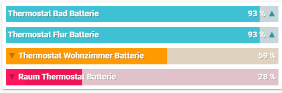

# Home Assistant Recipe's 

This page documents some Home Assistant recipe's collected from the community, many from this thread on the Home Assistant community website (https://community.home-assistant.io/t/drayton-wiser-home-assistant-integration/80965)

Thank you all

* Collection of Sensors (@phixion)
* Custom Lovelace Card (@phixion)
* Renaming History Graphs Element Names in  (@DrJohnT & @msp1974)
* Interacting with custom schedules using the Lovelace UI (@nofuse)
* Linking 3rd Party TRVs/Sensors to Wiser Heating  (@carloneb)

## Collection of Sensors ( **[phixion](https://github.com/phixion)**)

------

Following files assume you are separating out you configuration.yaml file into separate files (e.g. sensor.yaml,binary_sensor.yaml etc) as per https://www.home-assistant.io/docs/configuration/splitting_configuration/. if you want you can put these all in a single `configuration.yaml`.


binary_sensor.yaml: sensor to check if heating is turned on or off, also sets a suiting icon

```yaml
- platform: template
    heating_flur:
      friendly_name: Heating Flur
      value_template: '{{state_attr("climate.wiser_flur","control_output_state") == "On"}}'
      icon_template: >-
        
          mdi:radiator
        
          mdi:radiator-off
        
```

sensor.yaml: history_stat sensor **for today** utilizing the binary sensor from above

```yaml
- platform: history_stats
  name: Heating Flur On Today
  entity_id: binary_sensor.heating_flur
  state: 'on'
  type: time
  start: "{{ now().replace(hour=0).replace(minute=0).replace(second=0) }}"
  end: "{{ now() }}"
```

sensor.yaml: history_stat sensor **for yesterday** utilizing the binary sensor from above

```yaml
- platform: history_stats
  name: Heating Flur On Yesterday
  entity_id: binary_sensor.heating_flur
  state: 'on'
  type: time
  end: '{{ now().replace(hour=0).replace(minute=0).replace(second=0) }}'
  duration:
    hours: 24
```

sensor.yaml: history_stat sensor **for this week so far** utilizing the binary sensor from above

```yaml
- platform: history_stats
  name: Heating Flur On this Week
  entity_id: binary_sensor.heating_flur
  state: 'on'
  type: time
  start: "{{ as_timestamp( now().replace(hour=0).replace(minute=0).replace(second=0) ) - now().weekday() * 86400 }}"
  end: "{{ now() }}"
```

sensor.yaml: history_stat sensor **for the past 30 days** utilizing the binary sensor from above

```yaml
- platform: history_stats
  name: Heating Flur On past 30 days
  entity_id: binary_sensor.heating_flur
  state: 'on'
  type: time
  end: '{{ now().replace(hour=0).replace(minute=0).replace(second=0) }}'
  duration:
    days: 30
```

sensor.yaml: history_stats spits out unitof measuerment in hours, so here is a simple conversion

```yaml
- platform: template
  sensors:
    heating_time_flur:
      friendly_name: Heating Time Flur
      icon_template: mdi:radiator
      value_template: "{{ states('sensor.heating_flur_on_today') | float * 60 }}"
      unit_of_measurement: min
```


## Custom Lovelace Card (https://gist.github.com/phixion)

------





```yaml
# Template sensors to strip battery values out of their attributes
# Defaults to value 101, comes hin handy when crafting lovelace cards
# sets device class to battery to take care of fancy automated templated battery icons
# sets correct unit

    thermostat_wohnzimmer_battery_level:
      friendly_name: Thermostat Wohnzimmer Batterie
      value_template: "{{ states.sensor.wiser_itrv_wohnzimmer.attributes.battery_percent | default(101) | int if states.sensor.wiser_itrv_wohnzimmer.attributes.battery_percent is not none}}"
      device_class: battery
      unit_of_measurement: "%"
    thermostat_bad_battery_level:
      friendly_name: Thermostat Bad Batterie
      value_template: "{{ states.sensor.wiser_itrv_bad.attributes.battery_percent | default(101) | int if states.sensor.wiser_itrv_bad.attributes.battery_percent is not none}}"
      device_class: battery
      unit_of_measurement: "%"
    thermostat_flur_battery_level:
      friendly_name: Thermostat Flur Batterie
      value_template: "{{ states.sensor.wiser_itrv_flur.attributes.battery_percent | default(101) | int if states.sensor.wiser_itrv_flur.attributes.battery_percent is not none}}"
      device_class: battery
      unit_of_measurement: "%"
    thermostat_roomstat_battery_level:
      friendly_name: Raum Thermostat Batterie
      value_template: "{{ states.sensor.wiser_roomstat_wohnzimmer.attributes.battery_percent | default(101) | int if states.sensor.wiser_roomstat_wohnzimmer.attributes.battery_percent is not none}}"
      device_class: battery
      unit_of_measurement: "%"
      
# Lovelace card to create Battery Level bars out of our values with the help of auto-entities and custom bar card
# to draw a bar the battery value must be <101 otherwise its discarded, without ugly ui error messages 
# can look like https://i.phx.ms/P7Bi.png and https://i.phx.ms/vvwL.png
# card can easily be adapted to other battery attributes
card:
  align: split
  columns: 1
  height: 20
  rounding: 0px
  severity:
    - color: '#ff165d'
      value: 30
    - color: '#ff9a00'
      value: 60
    - color: '#3ec1d3'
      value: 100
  title_position: inside
  title_style:
    font-size: 14px
  type: 'custom:bar-card'
  unit_of_measurement: '%'
  value_style:
    font-size: 14px
  width: 100%
filter:
  include:
    - entity_id: sensor.thermostat*battery_level
      state: <101
type: 'custom:auto-entities'
```
# Renaming History Graphs Element Names 

------

If you want to rename element names in the history graphs you can. There are two ways you can do this. 

## Method 1

Add an override of the to the entity in the Lovelace UI (i.e. the name: Upstairs bit below).

```yaml
entities:
  - entity: climate.wiser_upstairs
    name: Upstairs
hours_to_show: 12
refresh_interval: 0
title: Upstairs Heating
type: history-graph
So now they read "Upstairs current temperature", "Upstairs heating" and "Upstairs target temperature". Still a little long, so I tried a space character and that works although the "c" in "current " is in lowercase :-(

entities:
  - entity: climate.wiser_upstairs
    name: ' '
hours_to_show: 12
refresh_interval: 0
title: Upstairs Heating
type: history-graph
```

## Method 2

Create template sensors from the attributes of the climate sensor. 

e.g.
```yaml
sensor:
  - platform: template
    sensors:
      lounge_current_temp:
        friendly_name: "Current"
        unit_of_measurement: "°C"
        value_template: "{{ state_attr('climate.wiser_lounge','current_temperature')}}"
        
      lounge_target_temp:
        friendly_name: "Target"
        unit_of_measurement: "°C"
        value_template: "{{ state_attr('climate.wiser_lounge','temperature')}}"
        
      lounge_heating:
        friendly_name: "Heating"
        value_template: "{{ state_attr('climate.wiser_lounge','control_output_state')}}"
```
if these are added to the  history graphs, elements will be named as per the friendly names above.

# Interacting with custom schedules using the Lovelace UI

------

One question popped on the thread was how to switch between different schedules using the UI. This pattern shows how this can be implemented so that you have different schedules and can switch between them in an instant!

Alas there is no way to view the schedules in HomeAssistant, a PR for this would be very welcome!


1. Create a script in Home Assistant


2. Create a card in lovelace


3. Which will eventually look like this on lovelace
 

   

# Linking 3rd Party TRVs/Sensors to Wiser Heating

------

@carloneb had the following scenario

He has a Drayton Wiser Basic Kit one thermostat in the kitchen but he doesnt have a Wiser TRV in the main room, he does however have a SONOFF Zibbee temperature sensor which is already integrated with Home Assistant. Can he get the heating to trigger the request for heat when the main room is cold? without purchasing a new TRV?

YES YES YES!

## How

Definitions:

In `Configuration.yaml`, defined a new generic thermostat entity for the kitchen: “cucina”. This thermostat is commanding a switch (defined later) which is then triggering the Wiser’s commands. Also, the generic thermostat is linked to the Sonoff Temperature sensor (sensor.t_cucina_temperature).

```yaml
climate:
  - platform: generic_thermostat
    name: cucina
    heater: switch.switch_t_cucina
    target_sensor: sensor.t_cucina_temperature
    min_temp: 5
    max_temp: 30
    ac_mode: false
    target_temp: 20
    cold_tolerance: 0.3
    hot_tolerance: 0
    initial_hvac_mode: "heat"

```

The switch used by the above thermostat is as follows. It calls the wiser.boost_heating service when on (demanding heat) and sets the wiser to auto when triggered off (target T reached).

```yaml
switch:
  - platform: template
    switches:
      switch_t_cucina:
        turn_on:
      service: wiser.boost_heating
        data:
        entity_id: climate.wiser_soggiorno
        time_period: 30
        temperature: 21
        temperature_delta: 1
        turn_off:
      service: climate.set_hvac_mode
        data:
        entity_id: climate.wiser_soggiorno
    hvac_mode: "auto"
```

Because the main temperature scheduling is owned by the wiser (it’s the master), I’ve created an automation that “copy” the scheduled temperature from the wiser to the Sonoff thermostat at any change.

```yaml
- alias: Set target T cucina
  description: Setta la T target di climate.cucina quando la T schedulata wiser cambia, tranne se in boost
  condition:
    condition: numeric_state
    entity_id: climate.wiser_soggiorno
      attribute: boost_remaining
    below: 1
  trigger:
  - platform: state
    entity_id: sensor.target_t
    action:
  - service: climate.set_temperature
    data:
    entity_id: climate.cucina
    temperature: "{{ (states('sensor.target_t') | float) }}"
```

In this way I can have both rooms heat following the scheduling set in the Wiser.


