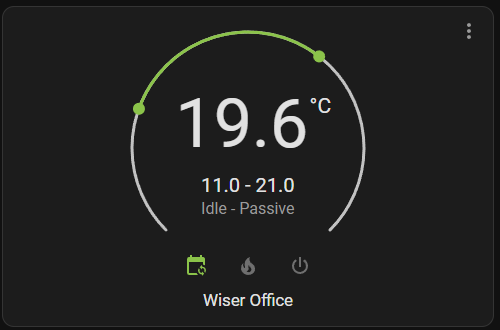
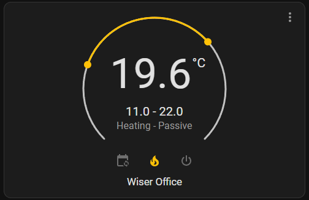
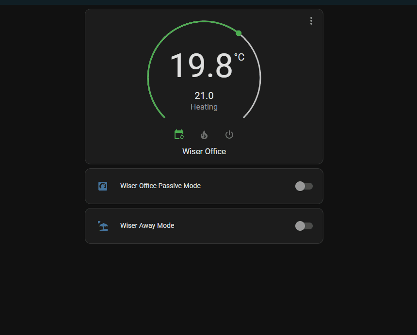

# In Built Automations

Currently there is only a single in built automation but more may come in the future.

## Passive Mode

Passive mode is designed to achieve a function that is not natively available from Wiser on the hub.  It is designed to set a room to only heat when other non-passive mode rooms call for heat (causing the boiler to fire).

It does this by setting the target temperature of the room lower than the current temp (down to the minimum setting) when no non-passive rooms are heating and then increasing the target temperature of the room when non-passive rooms are calling for heat thus heating the room to the set maximum temperature without the room itself causing the boiler to fire.

As this is not a native hub function, there are some things to be aware of.

1. The target temperature of the room is changed by the integration, so in the Wiser app or on a roomstat you may see unusual target temp settings for passive rooms.
2. The Wiser app will not show passive mode, just whther the room is following the schedule or not and the temperature settgin being driven by the automation.
3. If you use comfort mode to get your rooms up to temperature by a scheduled time, then this will not apply to passive rooms.  You will need to adjust your schedule to set the passive upper temperature earlier so that it will heat that room as other non-passive rooms heat under comfort mode.
4. Putting the hub in away mode will override passive mode and it will not function when in away mode.  However, there are functions which will override away mode and take the room out of this, however, this is a function of the Wiser system and how away mode is applied to rooms.
5. If you boost the room, this will also override passive mode and make the room non-passive whilst the boost is active.  At the end of the boost duration, it will return to passive mode.  This applies in both HVAC modes as described below.

## Enabling Passive Mode

You will need to enable this in the integration configuration Automation Options menu.  Once done, you will have a new switch entity in every room (with iTRVs) to enable/disable passive mode for that room.

When you enable passive mode for a room, the thermostat card will change to have a temperature range instead of the usual single target temperature.

There are 2 modes of operation:

1. HVAC Auto - In Auto mode, the passive mode will allow setting of the lower temp (which will cause the boiler to fire if the room temp goes below this lower setting), however, the upper temp settign is driven by the rooms schedule.  If you try to change this via the thermostat card, it will revert within a couple of seconds to the scheduled temp setting.

2. HVAC Heat - Also known as manual mode in the Wiser app.  This allows manual setting of the lower and upper temperatures for that room for which passive mode will manage.  These values are stored and will revert if you take the room out and then back into passive mode.  The lower temperature setting is common to both HVAC modes.

## Colour of Thermostat Card

Due to the way passive mode works, to be as compatible as possible with other integrations (especially assistants like Alexa, Google Home, Homekit etc), when in passive mode, the colour of the thermostat card icons and slider represent the HVAC mode with the designation on the heating status as Idle - Passive or Heating - Passive and the fact that the slider is a range instead of a single target.  If you wish for the card to show different colours when in passive mode, you can achieve this using card-mod.  The below example shows how to do this and make the card light green when in Auto-Passive and light orange when in Heat-Passive.  You can obviously change this to whatever colours you prefer.

```yaml
type: thermostat
entity: climate.wiser_office
card_mod:
  style: |-
    
      ha-card {
        --state-climate-heat-color: var(--amber-color);
        --state-climate-auto-color: var(--light-green-color);
      }
    
```

Some example pictures of the thermostat card




And a short video of it in use

